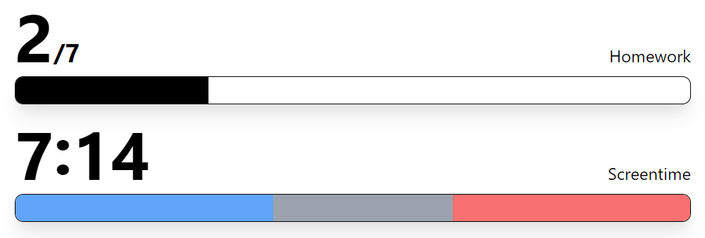

# Task Tracker
A flexible, simple and clean progress bar app. This app can display different types of information in an intuitive progress bar component. 
If you have a data integration that you think would fit this project, please open a pull request! I want this project to foster an environment of creativity, flexibility and community.

### What it looks like


### What it's made of
- ⌨ **TypeScript** - Ensures a friendly and welcoming development environment
- ⚛ **React** - Used for a easy, reusable way to create progress bars
- 🚅 **NodeJS** - Does the heavy lifting and fetching
- 🤝 **SWR** - Keeps data in the frontend up-to-date

### How to use it
1. Clone this repository
```sh
git clone https://github.com/wyatt/tasktracker
```
2. Install nodemodules/ for backend and frontend
```sh
cd frontend && yarn
cd backend && yarn
```
3. Add a .env file in backend/ 
Populate it with env variables for the progress bars you will use, visible below. Note: If you are using a Progress Bar that you haven't entered any credentials for, the backend will error. Available base env variables include:
```env
PORT=8888 
# If this is added/changed, it needs to be changed in the API_BASE variable in frontend/core/mutations
```
4. Run both the backend and the frontend servers.
```sh
backend $ yarn build && yarn start
frontend $ yarn build && yarn start
```
5. That's it. You should have:
```
frontend: http://localhost:3000
backend: http://localhost:8888
```

### Existing Progress Bars (env variables)
#### 📚 EduLinkOne - Homework Platform
```env
EDULINK_USERNAME="yourusername"
EDULINK_PASSWORD="yourpassword"
EDULINK_DOMAIN="yourdomain.edulinkone.com"
ESTABLISHMENT_ID="yourid" 
# Establishment ID is visible in the response from https://yourdomain.edulinkone.com/api/?method=EduLink.SchoolDetails
# Use inspect element to find
```
- 🕙 Rescuetime - Screentime Tracking
```env
RESCUETIME_KEY="yourapikey" # Can be created and found at https://www.rescuetime.com/anapi/manage
```


### Add your own
##### Backend
1. If your progress bar requires any API keys/secrets (highly likely), add your `.env` variable to the `env` class in `src/env.ts`
2. Add your fetch hooks/API calls as exported functions in a seperate, clearly named file in `src/methods/`
3. Add a method in `src/routes.ts` in this general syntax
```ts
api.get("/<method>", async (req, res) => {
  res.json(await <API function>(env.<api_key>));
});
```
Note: Add any custom types (interfaces) in `src/types.ts`
##### Frontend
[TailwindCSS](https://tailwindcss.com/) is used to style components. Simply define your styles in the `className={}` prop! If you're unsure, read the tailwind docs and look at the existing progress bars.
1. Add a `useSWR` hook in `src/core/hooks.ts` defining the type of the response in `src/core/types.ts`
2. Add your Bar component in `src/components/` with the naming convention `<Service>Bar.tsx`
3. Use the container components in `containers/`. Use the existing components for implementation examples. Avoid using normal html tags, instead, defer them to a appropriately named component in `container/`
4. For the actual bar, use the `helper/TaskBar.ts` component. The bar supports multiple colors as you can see from the "Screentime" example. To have multiple bars pass props in this syntax to the TaskBar component:
```ts
<TaskBar
  bars={[
    {
      percent: 0.6,
      color: "black",
      name: "value1",
    },
    {
      percent: 0.4,
      color: "blue-500", 
      // Color names are tailwindcss colors. 
      // View them here: https://tailwindcss.com/docs/customizing-colors
      name: "value2",
    }
  ]}
/>
```
That's it!
Send it as a pull request and I'll check it out and (most likely) merge it!
